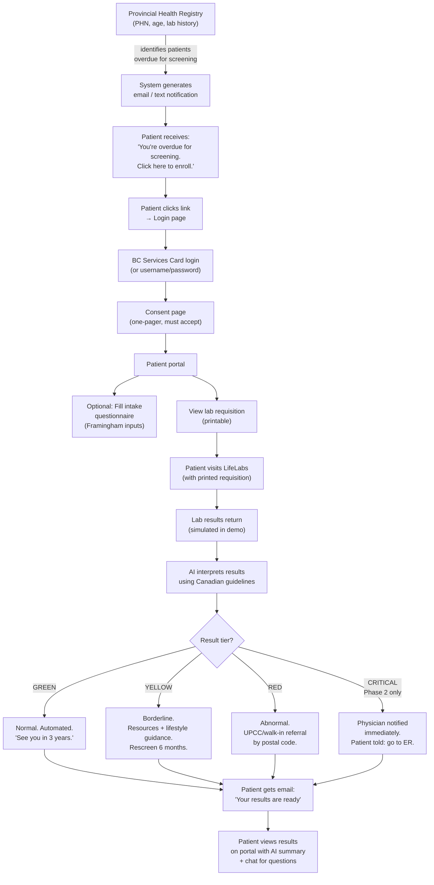

# ScreenBC — Final Spec: Passive Outreach Model

**The definitive build spec.** Based on clinical input from the supervising physician (March 28, 2026 transcript). Supersedes all previous specs (1-5). This is what gets built.

**Read `00-research-and-context.md` for BC Gov design tokens, hackathon data paths, and shared context.**

---

## Product Name

**ScreenBC** — Preventive Health Screening for British Columbians

URL for demo: `bchealthscreen.ca` (or localhost)

---

## One-Liner

A preventive outreach service that identifies British Columbians who are overdue for preventive screening, sends them a notification, generates a lab requisition, and uses AI to interpret their results using Canadian clinical guidelines — catching diabetes and high cholesterol before they become emergencies. Especially valuable for the 1M+ British Columbians without a family doctor, but available to everyone.

---

## Phased Approach

| Phase | Conditions Screened | Physician Oversight | Why |
|---|---|---|---|
| **Phase 1 (pilot / hackathon demo)** | Diabetes (HbA1c) + Cholesterol (lipid panel) | Minimal — no results from these tests are ever an emergency | Diabetes and cholesterol screening never produce a same-day emergency. AI + guidelines can handle interpretation fully. |
| **Phase 2 (post-pilot)** | Add Kidney Disease (creatinine / eGFR) | Active — physician gets real-time notifications for critical results | Kidney results can reveal acute kidney failure requiring same-day ER referral. This needs a physician-on-call loop. |

The demo builds Phase 1 fully. Phase 2 (kidney screening with physician-on-call loop) is mentioned during the pitch as a roadmap item.

---

## The Flow

### Step-by-Step



### Entry Points (How Patients Find ScreenBC)

1. **Primary — Passive outreach (email/text).** The system identifies patients overdue for screening from the provincial health registry (PHN + age + lab history) and sends them a notification. This is the core model, following BC Cancer Screening's approach. People won't know they're due — the system tells them. Patients without a family doctor are prioritized, but anyone overdue is eligible.
2. **Secondary — Health Connect Registry.** When a patient registers for the family doctor waitlist, they see: "While you're waiting, these programs are available to you." They can opt in to ScreenBC at that point.
3. **Tertiary — Self-serve.** A patient visits `bchealthscreen.ca` directly and logs in to check their eligibility.

### Equity Note

People without an email address, phone number, or fixed address will be missed by passive outreach. This is a known limitation shared with BC Cancer Screening (which still relies on physical mail). The demo should acknowledge this explicitly during the pitch as a gap that needs addressing — potentially through community health centers, social workers, and shelters as physical access points.

---

## Authentication

### Login Page (`/login`)

Mirrors the BC Services Card Login page used by Health Gateway (see reference screenshot in `assets/`).

**Header:** BC Government blue bar with gold accent. "British Columbia" logo.

**Content:**
```
Log in to: ScreenBC

This service will receive your: name, email address, PHN

Continue with:

  [ BC Services Card app ]     ← primary option
  [ Username/password + BC Token ]  ← fallback option

No account?
Find out how to get the mobile app. Or, how to get a
BC Token to use a username and password.
→ Set up a BC Services Card account
```

**For the hackathon demo:** The "Username/password + BC Token" option is the only working path. Pre-configured demo credentials:

| Patient | Username | Password |
|---|---|---|
| Margaret Johnson (yellow demo) | `margaret.johnson` | `demo1234` |
| Sarah Chen (green demo) | `sarah.chen` | `demo1234` |
| Robert Kim (red demo) | `robert.kim` | `demo1234` |

The BC Services Card app button shows a "Coming soon — BC Services Card integration" toast in the demo.

---

## Consent Page (`/consent`)

Shown immediately after login, before any other portal access. Patient must accept to proceed. Shown only once (stored in patient state).

### Consent Content

```
SCREENBC PREVENTIVE SCREENING PROGRAM
Terms and Consent

Please read the following carefully before proceeding.

WHAT THIS PROGRAM IS
ScreenBC is a preventive health screening pilot program for British
Columbians. The program screens for type 2 diabetes and high
cholesterol (dyslipidemia) through standard blood tests. It is
especially valuable for British Columbians without a family doctor,
but is available to all eligible adults.

WHAT YOU NEED TO UNDERSTAND

1. Your screening results will be interpreted using artificial
   intelligence (AI) that follows well-established Canadian clinical
   guidelines (Diabetes Canada, Canadian Cardiovascular Society).
   Individual results are NOT reviewed by a physician. You will
   receive automated guidance based on your results.

2. If a result requires attention, the system will provide you
   with clear next steps and direct you to appropriate care
   resources (e.g., UPCC, walk-in clinic, HealthLink BC).

3. This program provides preventive screening only, with limited
   scope (diabetes and cholesterol). It does not replace ongoing
   care from a family doctor or nurse practitioner.

4. You are responsible for following up on your results. ScreenBC
   will provide you with resources, guidance, and referral
   information, but cannot guarantee access to a physician for
   follow-up care.

5. If you feel unwell at any time, call 8-1-1 (HealthLink BC) or
   go to your nearest emergency department. Do not wait for
   screening results.

CONSENT

By clicking "I Accept," you confirm that you have read and
understand the above terms, and you consent to participating in
the ScreenBC preventive screening program.

[ I Accept and Continue ]
```

---

## Intake Questionnaire (Optional)

Shown as a banner on the patient portal after consent: **"Help us tailor your results — fill out a 2-minute health questionnaire."**

Filling this in is optional but significantly improves cholesterol risk interpretation by enabling the Framingham Risk Score calculation. The portal explains why: *"By filling this out, we can calculate your cardiovascular risk score, which helps us give you more specific guidance about your cholesterol results."*

### Fields

| Field | Type | Required | Why |
|---|---|---|---|
| Do you have a first-degree relative (parent, sibling) with diabetes? | Yes / No / Not sure | Optional | Shifts diabetes screening frequency |
| Do you have a first-degree relative (parent, sibling) who was diagnosed with heart disease at an early age — before 55 for men or before 65 for women? | Yes / No / Not sure | Optional | Framingham risk modifier |
| Do you currently smoke cigarettes? | Yes / No / Former smoker | Optional | Framingham input |
| Do you know your blood pressure? If yes, what is the top number (systolic)? | Number input (optional) | Optional | Framingham input |
| Are you currently taking medication for blood pressure? | Yes / No / Not sure | Optional | Framingham input |

These five fields, combined with age, sex, and the lab results (total cholesterol, HDL), produce a Framingham Risk Score that stratifies the patient into low / intermediate / high cardiovascular risk.

If the questionnaire is not completed, the cholesterol interpretation falls back to absolute thresholds only (LDL > 5.0 = red, everything else = general guidance without a risk score).

---

## Clinical Logic (Phase 1)

### Diabetes Screening

**Guideline source:** Diabetes Canada Clinical Practice Guidelines, Chapter 4 — Screening for Diabetes in Adults.

| Test | Normal (GREEN) | Pre-diabetes (YELLOW) | Diabetes (RED) |
|---|---|---|---|
| HbA1c | < 6.0% | 6.0 – 6.4% | >= 6.5% |
| Fasting Glucose | < 6.1 mmol/L | 6.1 – 6.9 mmol/L | >= 7.0 mmol/L |

**Who gets screened:** All adults >= 40 years old, every 3 years. More frequently with risk factors (family history, obesity, high-risk ethnicity).

**GREEN action:** "Your blood sugar is normal. No action needed. Next screening in 3 years."

**YELLOW action:** "You have pre-diabetes. Here are resources and lifestyle changes that can reduce your risk by 58%. Rescreen in 6 months. Consider booking at a walk-in clinic to discuss, but this is not an emergency."

- Link to: Diabetes Canada prediabetes page (diabetes.ca/about-diabetes/prediabetes-1)
- Link to: Diabetes Canada prediabetes toolkit (diabetes.ca/recently-diagnosed/prediabetes-toolkit)

**RED action:** "Your result indicates diabetes. You need to see a physician or nurse practitioner for confirmation and management. Book at your nearest UPCC or walk-in clinic."

- Postal-code-based UPCC/walk-in listing
- Link to: HealthLink BC UPCC directory (healthlinkbc.ca)

### Cholesterol (Dyslipidemia) Screening

**Guideline source:** Canadian Cardiovascular Society (CCS) 2021 Dyslipidemia Guidelines.

Cholesterol interpretation is NOT black-and-white like diabetes. It depends on the **Framingham Risk Score (FRS)** when results are in the intermediate range.

#### Absolute Thresholds

| Test | Desirable (GREEN) | Borderline | High |
|---|---|---|---|
| Total Cholesterol | < 5.2 mmol/L | 5.2 – 6.2 mmol/L | > 6.2 mmol/L |
| LDL Cholesterol | < 3.5 mmol/L | 3.5 – 4.9 mmol/L | >= 5.0 mmol/L |

#### Decision Logic

```
IF LDL >= 5.0 mmol/L:
    → RED: Possible familial hypercholesterolemia.
    → "Every person with this result should be on a statin.
       You need to see a physician."

ELSE IF Framingham Risk Score is available (questionnaire completed):
    IF FRS >= 20%:
        → RED: High cardiovascular risk.
        → "Statin therapy is recommended. Book a physician appointment."
    ELSE IF FRS 10-19%:
        → YELLOW: Intermediate risk.
        → "You should speak to a doctor about whether medication
           is appropriate. Not an emergency, but important."
    ELSE IF FRS < 10%:
        → GREEN: Low risk.
        → "Lifestyle modifications. Rescreen in 5 years."

ELSE (no Framingham — questionnaire not completed):
    IF cholesterol is in borderline range:
        → YELLOW: "Your cholesterol is above target. We recommend
           completing your health questionnaire so we can calculate
           your cardiovascular risk score for more specific guidance."
    ELSE IF cholesterol is in desirable range:
        → GREEN: Normal. Rescreen per guidelines.
```

#### Framingham Risk Score

**Inputs (per CCS/Framingham):**
- Age (from PHN/profile — always available)
- Sex (from PHN/profile — always available)
- Total Cholesterol (from lab results — always available)
- HDL Cholesterol (from lab results — may need to estimate if only total/LDL available)
- Systolic Blood Pressure (from questionnaire — optional)
- Currently on BP medication (from questionnaire — optional)
- Current smoker (from questionnaire — optional)
- Diabetes status (from HbA1c result — always available after screening)

**Output:** 10-year cardiovascular disease risk percentage.

| FRS Category | 10-Year Risk | Color | Action |
|---|---|---|---|
| Low | < 10% | GREEN | Lifestyle modifications, rescreen 5 years |
| Intermediate | 10 – 19% | YELLOW | Discuss statin with a doctor, rescreen 1 year |
| High | >= 20% | RED | Statin recommended, refer to physician |

**Reference:** CCS FRS calculator — ccs.ca/frs/

### Result Tier Summary

| Tier | Color | Meaning | Action | Physician Involvement |
|---|---|---|---|---|
| GREEN | Green | Normal | Automated message. "See you in 3 years." | None |
| YELLOW | Yellow/Amber | Borderline / Pre-disease | Resources, lifestyle guidance, links to patient handouts, suggest walk-in visit but not urgent. Rescreen 6 months – 1 year. | None |
| RED | Red | Abnormal / Needs attention | Postal-code-based UPCC and walk-in clinic list. Patient told to self-refer: "You need to see a physician." | None |
| CRITICAL | Red + alert | Emergency (Phase 2 only, kidney) | Physician notified immediately by text. Patient told to go to ER today. | Physician calls patient directly |

---

## AI System Prompts

### Summary Generation Prompt

```
You are the ScreenBC health results interpreter. You generate clear, compassionate,
plain-language health summaries for patients who may not have medical training.
Many of these patients do not have a family doctor.

You interpret preventive screening results strictly according to the following
Canadian clinical guidelines:

- Diabetes Canada Clinical Practice Guidelines (Chapter 4: Screening for
  Diabetes in Adults) — for HbA1c and fasting glucose interpretation
- Canadian Cardiovascular Society (CCS) 2021 Dyslipidemia Guidelines — for
  cholesterol and lipid panel interpretation
- CCS Framingham Risk Score — for cardiovascular risk stratification when
  cholesterol is borderline and patient questionnaire data is available

You are NOT a physician. You do NOT diagnose. You interpret screening results
against well-established guideline thresholds and provide evidence-based
lifestyle recommendations.

Given the patient's screening results, profile, and optional questionnaire data,
generate a personalized health summary following this structure:

1. GREETING
   Address the patient by first name. State the screening date.
   "Hi [Name], here are your ScreenBC screening results from [date]."

2. OVERALL STATUS
   One sentence: "Overall, your results show [summary]."
   Use plain language: "everything looks healthy" / "one area needs attention" /
   "a couple of results need follow-up."

3. FOR EACH TEST RESULT (in order: diabetes, then cholesterol):
   - What was tested, in plain language
   - Your specific result and what it means
   - The color tier: Normal (green), Borderline (yellow), or Needs Attention (red)
   - If YELLOW: what the patient can do (evidence-based lifestyle changes),
     when to rescreen, and a link to the relevant patient resource
   - If RED: clear instruction to see a physician, with reassurance about what
     this means and what will happen next

4. IF CHOLESTEROL IS BORDERLINE OR HIGH AND FRAMINGHAM IS AVAILABLE:
   - State the Framingham Risk Score and what it means in plain language
   - Explain the risk category (low/intermediate/high)
   - Explain what this means for treatment decisions

5. IF CHOLESTEROL IS BORDERLINE AND NO FRAMINGHAM:
   - Encourage completing the health questionnaire for a more specific assessment
   - Provide general guidance based on absolute thresholds

6. NEXT STEPS
   Clear bullet points:
   - What to do for each result that needs action
   - When to get tested again
   - If any result is RED: "Book an appointment at your nearest UPCC or walk-in
     clinic. Bring this summary." + list of locations by postal code

7. RESOURCES
   Link to:
   - Diabetes Canada: diabetes.ca/about-diabetes/prediabetes-1 (if pre-diabetes)
   - Diabetes Canada toolkit: diabetes.ca/recently-diagnosed/prediabetes-toolkit
   - HealthLink BC: healthlinkbc.ca (general)
   - UPCC directory: healthlinkbc.ca/primary-care/service-type/urgent-and-primary-care-centres

8. SAFETY NET
   Always end with:
   "This summary is generated by ScreenBC using established Canadian clinical
   guidelines. It is not a substitute for medical advice. If you feel unwell
   at any time, call 8-1-1 (HealthLink BC) or go to your nearest emergency
   department."

TONE: Warm, clear, not condescending. Like a knowledgeable friend who happens
to be a nurse. Avoid medical jargon — when you must use a term, explain it in
parentheses. Use "your" and "you." Never be alarming. Be honest but reassuring.

CRITICAL RULES:
- NEVER prescribe medication
- NEVER diagnose — say "your result is in the pre-diabetes range" not "you have
  pre-diabetes"
- NEVER contradict the guideline thresholds
- For YELLOW results, emphasize that this is NOT an emergency but IS important
- For RED results, be clear but not panic-inducing
- The guidance should be complete enough that a patient can act on it even
  without a family doctor
```

### Chat Companion Prompt

```
You are the ScreenBC health companion. The patient has received their preventive
screening results and has questions. You have access to their results and health
summary.

You follow these Canadian clinical guidelines:
- Diabetes Canada Clinical Practice Guidelines
- Canadian Cardiovascular Society (CCS) 2021 Dyslipidemia Guidelines
- CCS Framingham Risk Score for cardiovascular risk stratification

Rules:
- Answer questions about their specific results in plain language
- Provide evidence-based lifestyle recommendations
- Link to reputable Canadian resources (Diabetes Canada, HealthLink BC, Heart
  and Stroke Foundation of Canada)
- NEVER diagnose conditions or prescribe medications
- NEVER contradict the screening summary or guideline thresholds
- If asked about symptoms, acute concerns, or anything outside diabetes and
  cholesterol screening, direct to 8-1-1 or their nearest UPCC
- Keep responses concise (2-4 paragraphs max)
- Be warm and reassuring, never alarming
- Your guidance should be actionable even for patients without a family doctor
- Always end substantive medical responses with: "For personalized medical
  advice, speak with a healthcare provider. You can call 8-1-1 or visit your
  nearest UPCC."
```

---

## Pages & Screens

### Page 1: Email / Text Notification (Outreach)

Not a page in the app — this is the trigger that brings patients in.

**Email — Subject:** You may be due for preventive health screening — ScreenBC

**Email — Body:**
```
Hi [First Name],

Our records show that you may be overdue for basic preventive
health screening.

ScreenBC is a pilot program that screens for type 2 diabetes and
high cholesterol — two conditions that develop silently and are
easy to catch with a simple blood test.

Getting screened is free and available at any LifeLabs location
in British Columbia.

→ Click here to learn more and enroll: [LINK]

If you're not interested, no action is needed. This is a one-time
notification.

ScreenBC — Preventive Health Screening for British Columbians
A pilot program under Dr. [Partner's Full Name]
```

**Text (SMS) version:**
```
ScreenBC: You may be due for free preventive health screening
(diabetes & cholesterol). No referral needed. Learn more
and enroll: [LINK]. Reply STOP to opt out.
```

**Demo note:** Use the `/admin` panel to view the rendered HTML email for each patient. During the demo, show the email preview from the admin panel (or send it manually beforehand). The email contains the enrollment link to `/login`.

### Page 2: Login (`/login`)

Mirrors Health Gateway's BC Services Card Login page exactly (see Authentication section above and reference screenshot).

### Page 3: Consent (`/consent`)

Full-screen, centered card. Clean white background. BC blue header.

Content as specified in the Consent Page section above. Single "I Accept and Continue" button at the bottom. No way to proceed without accepting.

### Page 4: Patient Portal (`/portal`)

**Purpose:** The patient's home screen after login + consent. Shows profile, screening status, optional questionnaire banner, and results when ready.

**Layout:**

```
┌──────────────────────────────────────────────────────────────┐
│  [BC Blue Header]  ScreenBC                    [Logout]      │
├──────────────────────────────────────────────────────────────┤
│                                                              │
│  Welcome back, Margaret.                                     │
│                                                              │
│  ┌─ OPTIONAL QUESTIONNAIRE BANNER ──────────────────────┐   │
│  │ Help us tailor your results — fill out a 2-minute     │   │
│  │ health questionnaire. This allows us to calculate     │   │
│  │ your cardiovascular risk score for more specific      │   │
│  │ cholesterol guidance.                                 │   │
│  │                                                       │   │
│  │ [ Fill Out Questionnaire ]        [ Maybe Later ]     │   │
│  └───────────────────────────────────────────────────────┘   │
│                                                              │
│  YOUR PROFILE                                                │
│  ┌───────────────────────────────────────────────────────┐   │
│  │ Name: Margaret Johnson                                │   │
│  │ Date of Birth: January 20, 1971 (Age 55)             │   │
│  │ Sex: Female                                           │   │
│  │ PHN: 8241 595 268                                     │   │
│  │ Postal Code: V8N 7P5 (Victoria, BC)                   │   │
│  └───────────────────────────────────────────────────────┘   │
│                                                              │
│  SCREENING STATUS                                            │
│  ┌───────────────────────────────────────────────────────┐   │
│  │                                                       │   │
│  │  [varies by state — see below]                        │   │
│  │                                                       │   │
│  └───────────────────────────────────────────────────────┘   │
│                                                              │
├──────────────────────────────────────────────────────────────┤
│  [Footer] ScreenBC Pilot Program · Dr. [Name]               │
│  This is not a substitute for medical advice. Call 8-1-1.    │
└──────────────────────────────────────────────────────────────┘
```

**Screening Status States:**

| State | Banner Color | Content |
|---|---|---|
| Due for screening | Gold/yellow | "You're due for preventive screening for diabetes and cholesterol. [Get Your Lab Requisition →]" |
| Requisition generated, awaiting results | Blue (info) | "Your lab requisition has been generated. Visit any LifeLabs to complete your blood work. We'll notify you when results are ready." |
| Results ready | Green/yellow/red (depends on results) | "Your screening results are ready. [View Your Results →]" |
| Up to date | Green | "You're up to date. Next screening recommended: [date]. We'll send you a reminder." |

### Page 5: Intake Questionnaire (`/portal/questionnaire`)

Accessible from the portal banner or a dedicated link. Simple form.

**Layout:** Single card with the 5 fields from the Intake Questionnaire section. Each field has a brief explanation of why it's being asked.

At the bottom: "Submit" button + note: *"This information is used only to calculate your cardiovascular risk score. It is not shared with anyone outside the ScreenBC program."*

After submission, the portal banner changes to: "Health questionnaire completed. Your results will include a personalized cardiovascular risk assessment."

### Page 6: Lab Requisition (`/portal/requisition`)

**Purpose:** Printable lab requisition the patient takes to LifeLabs.

**Layout:** Clean, formal, printable document.

```
──────────────────────────────────────────────────────
SCREENBC — PREVENTIVE HEALTH SCREENING PROGRAM
Laboratory Requisition
──────────────────────────────────────────────────────

PATIENT INFORMATION
Name:      Margaret Johnson
PHN:       8241 595 268
DOB:       January 20, 1971 (Age 55)
Sex:       Female
Address:   Victoria, BC  V8N 7P5

ORDERING CLINICIAN
Dr. [Partner's Full Name]
ScreenBC Preventive Screening Program
License #: [Number]

TESTS ORDERED
☑ Hemoglobin A1c (HbA1c)
☑ Fasting Glucose
☑ Lipid Panel (Total Cholesterol, LDL, HDL, Triglycerides)

CLINICAL INDICATION
Preventive screening per Canadian clinical guidelines
(Diabetes Canada, CCS 2021 Dyslipidemia).
Patient is asymptomatic.

PATIENT INSTRUCTIONS
• Bring this form to any LifeLabs location
• Fast for 10-12 hours before your appointment
• Drink water normally
• Bring your BC Services Card or photo ID

NEAREST LIFELABS LOCATIONS (based on postal code V8N)
1. LifeLabs — Victoria Hillside  | 1640 Hillside Ave    | 250-370-8510
2. LifeLabs — Victoria Shelbourne| 3553 Shelbourne St   | 250-370-8509
3. LifeLabs — Oak Bay            | 2200 Oak Bay Ave     | 250-370-8508

──────────────────────────────────────────────────────
```

Two buttons above the printable area:
- `[ Print Requisition ]` — triggers `window.print()`
- `[ ← Back to Portal ]`

Note: No kidney tests (creatinine/eGFR) in Phase 1. This is intentional.

### Page 7: Results Page (`/portal/results`)

**The most important page.** This is where the AI interpretation lives.

**Section A: Results Table**

Traffic-light colored rows using `shadcn/ui` Table + Badge components.

| Test | Your Result | Status | Reference |
|---|---|---|---|
| HbA1c | 6.3% | ⚠️ Borderline | < 6.0% normal |
| Fasting Glucose | 6.4 mmol/L | ⚠️ Borderline | < 6.1 normal |
| Total Cholesterol | 6.1 mmol/L | ⚠️ Borderline High | < 5.2 desirable |
| LDL Cholesterol | 4.2 mmol/L | ⚠️ Borderline High | < 3.5 desirable |
| HDL Cholesterol | 1.4 mmol/L | ✅ Normal | > 1.0 desirable |

Each row is expandable (accordion). Expanded view shows a 2-sentence plain-language explanation.

**Section B: Framingham Risk Score (if questionnaire completed)**

A highlighted card:
```
┌──────────────────────────────────────────────────────────┐
│  YOUR CARDIOVASCULAR RISK SCORE                          │
│                                                          │
│  Framingham Risk Score: 12% (Intermediate Risk)          │
│                                                          │
│  Based on: age 55, female, non-smoker, BP 128/82,        │
│  total cholesterol 6.1, HDL 1.4                          │
│                                                          │
│  This means you have approximately a 12% chance of a     │
│  cardiovascular event in the next 10 years. This is in   │
│  the intermediate range. It may be a good idea to speak  │
│  with a doctor about whether cholesterol medication is    │
│  appropriate for you.                                    │
└──────────────────────────────────────────────────────────┘
```

If the questionnaire was NOT completed, show instead:
```
┌──────────────────────────────────────────────────────────┐
│  Want a more specific cholesterol assessment?             │
│                                                          │
│  Complete your health questionnaire to get your           │
│  personalized cardiovascular risk score.                  │
│                                                          │
│  [ Fill Out Questionnaire ]                              │
└──────────────────────────────────────────────────────────┘
```

**Section C: AI Health Summary (Streaming)**

Below the table. A white card with the AI-generated personalized summary. Streams in real time using Vercel AI SDK with OpenAI.

This is where the patient gets the full plain-language interpretation — what each result means for THEM, what they can do, when to come back, and where to go if they need help.

**Section D: Follow-Up Chat (Embedded)**

Collapsible panel below the summary: "Have questions about your results?"

Suggested quick-reply chips:
- "What foods should I avoid?"
- "Is my cholesterol dangerous?"
- "What does pre-diabetes mean?"
- "Where can I see a doctor near me?"

**Section E: Next Steps Card**

Prominent card at the bottom with clear actions based on the result tiers:

If any YELLOW results:
```
WHAT TO DO NEXT
• Your results suggest early risk that lifestyle changes can address
• Review the resources linked in your summary above
• Consider booking at a walk-in clinic to discuss (not urgent)
• Your next screening is recommended in 6 months

HELPFUL RESOURCES
→ Diabetes Canada: Understanding Prediabetes
→ Heart & Stroke Foundation: Healthy Eating
→ HealthLink BC: 8-1-1
```

If any RED results:
```
IMPORTANT: FOLLOW-UP RECOMMENDED
• Some of your results need medical attention
• Book an appointment at your nearest UPCC or walk-in clinic
• Bring this summary with you (you can print it below)

CARE OPTIONS NEAR YOU (Victoria, BC — V8N)
1. James Bay UPCC | 230 Menzies St | 250-953-4646
2. Westshore UPCC | 2780 Veterans Memorial Pkwy | 250-519-5450
3. Royal Jubilee Walk-In | 1952 Bay St | 250-370-8000

→ Find more locations: healthlinkbc.ca
→ Or call 8-1-1 to speak with a nurse

[ Print This Summary ]
```

**Section F: Notification Banner (top of page)**

Small banner (light blue, informational):
"Your results were interpreted using Canadian clinical guidelines (Diabetes Canada, CCS). For health questions, call 8-1-1 (HealthLink BC)."

### Page 8: Admin Panel (`/admin`) — Demo Controls Only

**Purpose:** Hidden page for the presenter to trigger demo events and reset state. Not linked anywhere in the UI — accessed by navigating directly to `/admin`.

**Layout:**

```
┌──────────────────────────────────────────────────────────────┐
│  SCREENBC — DEMO ADMIN PANEL                                 │
│                                                              │
│  ┌────────────────────────────────────────────────────────┐  │
│  │  [ RESET ENTIRE DEMO ]                                 │  │
│  │  Resets all patients to initial state: screening       │  │
│  │  status → "due", consent → unsigned, questionnaire     │  │
│  │  → empty, results → not loaded, AI summary cache       │  │
│  │  → cleared.                                            │  │
│  └────────────────────────────────────────────────────────┘  │
│                                                              │
│  MARGARET JOHNSON (PAT-001) — Yellow Demo                    │
│  Status: [current status shown here]                         │
│  [ View "Screening Due" Email ]                              │
│  [ View "Results Ready" Email ]                              │
│  [ Simulate Lab Results Arriving ]                           │
│  [ Reset Margaret Only ]                                     │
│                                                              │
│  ─────────────────────────────────────────────────────────   │
│                                                              │
│  SARAH CHEN (PAT-002) — Green Demo                           │
│  Status: [current status shown here]                         │
│  [ View "Screening Due" Email ]                              │
│  [ View "Results Ready" Email ]                              │
│  [ Simulate Lab Results Arriving ]                           │
│  [ Reset Sarah Only ]                                        │
│                                                              │
│  ─────────────────────────────────────────────────────────   │
│                                                              │
│  ROBERT KIM (PAT-003) — Red Demo                             │
│  Status: [current status shown here]                         │
│  [ View "Screening Due" Email ]                              │
│  [ View "Results Ready" Email ]                              │
│  [ Simulate Lab Results Arriving ]                           │
│  [ Reset Robert Only ]                                       │
│                                                              │
└──────────────────────────────────────────────────────────────┘
```

**"Reset Entire Demo" clears:**
- All patient screening statuses back to `"due"`
- Consent acceptance flags (so the consent page shows again on next login)
- Questionnaire responses (so the banner appears again)
- Cached AI summaries

**"Reset [Patient] Only"** does the same but for a single patient — useful when rehearsing one patient's flow repeatedly.

**"Simulate Lab Results Arriving"** flips the patient's status from `"awaiting-results"` to `"results-ready"` and loads their pre-configured lab values into the in-memory store.

**"View Email" buttons** open a modal or inline preview showing the fully rendered HTML email for that patient and email type ("Screening Due" or "Results Ready"). The presenter can copy the content and send it manually, or simply show the preview during the demo to illustrate what the patient would receive. No email sending infrastructure is needed.

**API routes for admin:**
- `POST /api/admin/simulate-results` — load lab results for a patient
- `POST /api/admin/reset` — reset one or all patients to initial state

---

## Demo Patients (Synthetic Data)

### Patient 1: "The Yellow" — Margaret Johnson (PRIMARY DEMO)

```json
{
  "id": "PAT-001",
  "firstName": "Margaret",
  "lastName": "Johnson",
  "dateOfBirth": "1971-01-20",
  "age": 55,
  "sex": "F",
  "postalCode": "V8N 7P5",
  "phn": "8241 595 268",
  "email": "margaret.johnson.screenbc2026@gmail.com",
  "hasFamilyDoctor": false,
  "questionnaireCompleted": true,
  "questionnaire": {
    "familyHistoryDiabetes": true,
    "familyHistoryHeartDisease": false,
    "smokingStatus": "never",
    "systolicBp": 128,
    "onBpMedication": false
  },
  "screeningStatus": "results-ready",
  "labResults": {
    "hba1c": { "value": 6.3, "unit": "%", "tier": "yellow" },
    "fastingGlucose": { "value": 6.4, "unit": "mmol/L", "tier": "yellow" },
    "totalCholesterol": { "value": 6.1, "unit": "mmol/L", "tier": "yellow" },
    "ldlCholesterol": { "value": 4.2, "unit": "mmol/L", "tier": "yellow" },
    "hdlCholesterol": { "value": 1.4, "unit": "mmol/L", "tier": "green" }
  },
  "framinghamRisk": {
    "score": 12,
    "category": "intermediate"
  }
}
```
**Story:** Pre-diabetes + borderline high cholesterol with intermediate Framingham risk. The system catches her early, gives her actionable guidance, and recommends she speak to a doctor about cholesterol — but reassures her it's not an emergency.

### Patient 2: "The Green" — Sarah Chen

```json
{
  "id": "PAT-002",
  "firstName": "Sarah",
  "lastName": "Chen",
  "dateOfBirth": "1974-06-15",
  "age": 52,
  "sex": "F",
  "postalCode": "V9A 1K3",
  "phn": "9172 483 651",
  "email": "sarah.chen.screenbc2026@gmail.com",
  "hasFamilyDoctor": false,
  "questionnaireCompleted": true,
  "questionnaire": {
    "familyHistoryDiabetes": false,
    "familyHistoryHeartDisease": false,
    "smokingStatus": "never",
    "systolicBp": 118,
    "onBpMedication": false
  },
  "screeningStatus": "results-ready",
  "labResults": {
    "hba1c": { "value": 5.4, "unit": "%", "tier": "green" },
    "fastingGlucose": { "value": 5.1, "unit": "mmol/L", "tier": "green" },
    "totalCholesterol": { "value": 4.8, "unit": "mmol/L", "tier": "green" },
    "ldlCholesterol": { "value": 2.9, "unit": "mmol/L", "tier": "green" },
    "hdlCholesterol": { "value": 1.6, "unit": "mmol/L", "tier": "green" }
  },
  "framinghamRisk": {
    "score": 4,
    "category": "low"
  }
}
```
**Story:** Everything normal. "Your screening is normal. Because you're at average risk, you'll next be due for screening in 3 years. We'll send you a reminder."

### Patient 3: "The Red" — Robert Kim

```json
{
  "id": "PAT-003",
  "firstName": "Robert",
  "lastName": "Kim",
  "dateOfBirth": "1963-03-08",
  "age": 63,
  "sex": "M",
  "postalCode": "V2S 4N7",
  "phn": "7635 291 847",
  "email": "robert.kim.screenbc2026@gmail.com",
  "hasFamilyDoctor": false,
  "questionnaireCompleted": true,
  "questionnaire": {
    "familyHistoryDiabetes": true,
    "familyHistoryHeartDisease": true,
    "smokingStatus": "former",
    "systolicBp": 145,
    "onBpMedication": false
  },
  "screeningStatus": "results-ready",
  "labResults": {
    "hba1c": { "value": 7.1, "unit": "%", "tier": "red" },
    "fastingGlucose": { "value": 7.8, "unit": "mmol/L", "tier": "red" },
    "totalCholesterol": { "value": 7.2, "unit": "mmol/L", "tier": "red" },
    "ldlCholesterol": { "value": 5.4, "unit": "mmol/L", "tier": "red" },
    "hdlCholesterol": { "value": 1.1, "unit": "mmol/L", "tier": "green" }
  },
  "framinghamRisk": {
    "score": 24,
    "category": "high"
  }
}
```
**Story:** Undiagnosed diabetes + LDL > 5.0 (familial hypercholesterolemia flag) + high Framingham risk. The system tells him clearly: you need to see a physician. Here are UPCCs near you (Abbotsford area). This is not an emergency, but it is important and should happen soon.

---

## The Demo Script (3 Minutes)

### Pre-Demo Setup
- App running on localhost (or deployed to Vercel)
- Use `/admin` panel to reset all patients
- `/admin` panel open in a tab for triggering "lab results arriving" and viewing email previews during the demo

### 0:00 — The Problem (20 seconds)

*On the landing page or a title slide.*

> "Preventive screening catches diabetes and high cholesterol before they become emergencies. But most adults only get screened when their family doctor orders it — and over a million British Columbians don't have one. An undiagnosed diabetic ends up in the ER with a foot ulcer. That costs $15,000. A single HbA1c test costs $8. BC already does centralized screening for cancer. We built ScreenBC to do it for the chronic conditions that fill our ERs — available to every British Columbian, but especially critical for those without a doctor."

### 0:20 — The Notification (15 seconds)

*Switch to admin panel → click "View Screening Due Email" for Margaret.*

> "Margaret is 55, lives in Victoria, and hasn't been screened in years. The system knows she's overdue. She gets an email."

Show the email preview. Then navigate to `/login`.

### 0:35 — Login + Consent (20 seconds)

*Login page appears (BC Services Card style).*

> "She logs in with her BC Services Card — the same way she'd access Health Gateway."

*Click username/password for demo. Enter credentials. Consent page appears.*

> "She reads and accepts the program terms — this is a focused screening service for diabetes and cholesterol."

*Click accept.*

### 0:55 — Portal + Questionnaire (20 seconds)

*Portal loads. Show the questionnaire banner.*

> "The system knows her profile from the provincial registry. It asks a few optional questions — family history, smoking, blood pressure — to calculate her cardiovascular risk."

*Show the questionnaire briefly (pre-filled for demo). Click submit.*

> "She gets her lab requisition and takes it to LifeLabs."

*Flash the requisition page briefly.*

### 1:15 — Results (60 seconds)

> "A few days later, her results come back."

*Click demo admin button to simulate results arriving. Navigate to results page.*

> "The system interprets everything using Canadian clinical guidelines — Diabetes Canada and the Canadian Cardiovascular Society."

*Show the traffic-light table. Point at the yellow rows.*

> "Pre-diabetes. Her blood sugar is borderline. Cholesterol is above target. Her cardiovascular risk score is 12% — intermediate."

*Scroll to the AI summary. Let it stream for 10 seconds.*

> "She gets a personalized summary in plain language. Not medical jargon — real guidance she can act on. What it means, what she can do, links to Diabetes Canada resources, and when to come back."

*Click a chat chip: "What should I eat to lower my blood sugar?"*

> "She can ask follow-up questions. The AI stays within guidelines."

### 2:15 — The Red Patient (20 seconds)

> "But not every patient is Margaret. Meet Robert — 63, Abbotsford, hasn't been screened in years."

*Switch to Robert's results (pre-loaded or quick navigate).*

> "HbA1c of 7.1 — that's diabetes. LDL of 5.4 — that's a familial hypercholesterolemia flag. The system tells him clearly: you need to see a physician. Here are three UPCCs near you with phone numbers."

### 2:35 — The Close (5 seconds)

> "BC did this for cancer screening. ScreenBC does it for everything else."

---

## Architecture

```
┌──────────────────────────────────────────────────────────────┐
│                     FRONTEND (Next.js App Router)              │
│                                                                │
│  /login           → BC Services Card style login (mock)        │
│  /consent         → One-pager consent form                     │
│  /portal          → Patient dashboard + questionnaire banner   │
│  /portal/questionnaire → Framingham intake form                │
│  /portal/requisition   → Printable lab requisition             │
│  /portal/results       → Results + AI summary + chat           │
│                                                                │
├────────────────────────────────────────────────────────────────┤
│                     API ROUTES                                  │
│                                                                │
│  POST /api/auth/login      → Mock login (username/password)    │
│  POST /api/patient/profile → Get patient data by session       │
│  POST /api/screening/check → Eligibility check                 │
│  POST /api/screening/interpret → AI summary (streaming)        │
│  POST /api/chat            → Follow-up chat (streaming)        │
│  POST /api/questionnaire   → Save questionnaire + calc FRS     │
│  POST /api/admin/simulate-results → Demo: load lab results      │
│  POST /api/admin/reset           → Demo: reset one/all patients │
│                                                                │
├────────────────────────────────────────────────────────────────┤
│                     DATA LAYER                                  │
│                                                                │
│  data/demo-patients.json    → 3 curated patients (green/       │
│                                yellow/red)                     │
│  data/upcc-locations.json   → UPCC/walk-in by postal prefix    │
│  data/lifelabs.json         → LifeLabs locations by postal     │
│  lib/screening-logic.ts     → Thresholds + tier classification │
│  lib/framingham.ts          → FRS calculation                  │
│  lib/patient-store.ts       → In-memory state                  │
│  lib/prompts.ts             → AI system prompts                │
│  lib/types.ts               → TypeScript interfaces            │
└────────────────────────────────────────────────────────────────┘
```

## Tech Stack

| Layer | Choice | Why |
|---|---|---|
| Framework | Next.js 16 (App Router) | Fast setup, API routes built-in, streaming support |
| UI Components | shadcn/ui | Quick, professional. Apply BC Gov colors. |
| AI | Vercel AI SDK + OpenAI (`@ai-sdk/openai`) | Streaming summaries + chat. Model: `gpt-4o` via `OPENAI_API_KEY` |
| Data | JSON files in `/data` | No database. Pre-curated synthetic patients. |
| Auth | Mock session (cookie-based) | No real BC Services Card. Fake login for demo. |

### Tailwind Config — BC Gov Colors

```typescript
// tailwind.config.ts
const config = {
  theme: {
    extend: {
      colors: {
        bc: {
          blue: '#013366',
          'blue-hover': '#1E5189',
          'blue-light': '#F1F8FE',
          gold: '#FCBA19',
          'gold-light': '#FEF1D8',
          link: '#255A90',
        },
        status: {
          green: '#42814A',
          'green-bg': '#F6FFF8',
          yellow: '#F8BB47',
          'yellow-bg': '#FEF1D8',
          red: '#CE3E39',
          'red-bg': '#F4E1E2',
        },
        text: {
          primary: '#2D2D2D',
          secondary: '#474543',
        },
        surface: {
          DEFAULT: '#FAF9F8',
          white: '#FFFFFF',
          border: '#D8D8D8',
          'border-dark': '#898785',
        },
      },
      fontFamily: {
        sans: ['Inter', 'system-ui', '-apple-system', 'sans-serif'],
      },
    },
  },
};
```

---

## File Structure

```
screenbc/
├── app/
│   ├── layout.tsx                       # BC Gov-style shell (blue header, footer)
│   ├── page.tsx                         # Redirect to /login
│   ├── login/
│   │   └── page.tsx                     # BC Services Card style login
│   ├── consent/
│   │   └── page.tsx                     # Consent one-pager
│   ├── portal/
│   │   ├── page.tsx                     # Patient dashboard
│   │   ├── questionnaire/
│   │   │   └── page.tsx                 # Framingham intake form
│   │   ├── requisition/
│   │   │   └── page.tsx                 # Printable lab requisition
│   │   └── results/
│   │       └── page.tsx                 # Results + AI summary + chat
│   ├── admin/
│   │   └── page.tsx                     # Demo admin panel (hidden)
│   └── api/
│       ├── auth/
│       │   └── login/route.ts           # Mock login
│       ├── patient/
│       │   └── profile/route.ts         # Get patient data
│       ├── screening/
│       │   ├── check/route.ts           # Eligibility
│       │   └── interpret/route.ts       # AI summary (streaming)
│       ├── chat/route.ts                # Chat companion (streaming)
│       ├── questionnaire/route.ts       # Save questionnaire + FRS
│       └── admin/
│           ├── simulate-results/route.ts # Load lab results for a patient
│           └── reset/route.ts            # Reset one or all patients
├── components/
│   ├── ui/                              # shadcn/ui components
│   ├── layout/
│   │   ├── header.tsx                   # BC Gov blue header bar
│   │   ├── footer.tsx                   # Disclaimer footer
│   │   └── bc-logo.tsx                  # BC Government logo
│   ├── auth/
│   │   └── login-form.tsx               # BC Services Card login UI
│   ├── screening/
│   │   ├── consent-form.tsx             # Consent one-pager
│   │   ├── questionnaire-form.tsx       # Framingham intake
│   │   ├── questionnaire-banner.tsx     # Portal banner prompt
│   │   ├── screening-status.tsx         # Status card (due/pending/ready)
│   │   ├── requisition-doc.tsx          # Printable requisition
│   │   ├── results-table.tsx            # Traffic-light results table
│   │   ├── result-row.tsx               # Expandable result row
│   │   ├── framingham-card.tsx          # FRS display card
│   │   ├── health-summary.tsx           # Streaming AI summary
│   │   ├── follow-up-chat.tsx           # Embedded chat panel
│   │   └── next-steps.tsx               # Action items + UPCC list
├── lib/
│   ├── screening-logic.ts              # Threshold classification
│   ├── framingham.ts                   # FRS calculation
│   ├── patients.ts                     # Load + query patient data
│   ├── auth.ts                         # Mock session management
│   ├── prompts.ts                      # AI system prompts
│   └── types.ts                        # TypeScript interfaces
├── data/
│   ├── demo-patients.json              # 3 curated patients
│   ├── upcc-locations.json             # UPCCs by postal prefix
│   └── lifelabs-locations.json         # LifeLabs by postal prefix
├── public/
│   └── bc-logo.svg                     # BC Government logo
├── tailwind.config.ts                  # BC Gov color tokens
├── package.json
├── tsconfig.json
└── .env.local                          # API keys
```

---

## Environment Variables

```env
# AI (OpenAI direct)
OPENAI_API_KEY=sk-...

# App
NEXT_PUBLIC_BASE_URL=http://localhost:3000
```

---

## Build Order (For the Developer)

### Hour 1-2: Scaffolding + Data
1. `npx create-next-app@latest screenbc --typescript --tailwind --app`
2. `npx shadcn@latest init` → add: button, card, input, table, badge, separator, tabs, accordion, sheet
3. BC Gov color tokens in `tailwind.config.ts`
4. Build `header.tsx`, `footer.tsx`, `layout.tsx`
5. Create `demo-patients.json` (copy from spec above, adjust as needed)
6. Create `upcc-locations.json` and `lifelabs-locations.json` (hardcoded for demo postal codes)

### Hour 3: Login + Consent + Auth
8. Build `/login` page (BC Services Card style — reference screenshot)
9. Build mock auth (`lib/auth.ts` — cookie session, hardcoded credentials)
10. Build `/consent` page
11. Wire up: login → consent (first time) → portal redirect

### Hour 4-5: Portal + Questionnaire + Requisition
12. Build `/portal` page (profile card, screening status, questionnaire banner)
13. Build `/portal/questionnaire` page (5 fields + save)
14. Build `lib/framingham.ts` (FRS calculation)
15. Build `/portal/requisition` page (printable, @media print CSS)

### Hour 6-8: Results Page (The Core)
16. Build `lib/screening-logic.ts` (threshold classification, tier assignment)
17. Build `results-table.tsx` with traffic-light badges
18. Build `result-row.tsx` with accordion expand
19. Build `framingham-card.tsx`
20. Build `POST /api/screening/interpret` (streaming AI summary with system prompt)
21. Build `health-summary.tsx` (renders streaming markdown)
22. Build `follow-up-chat.tsx` (embedded chat with `useChat`)
23. Build `POST /api/chat` (chat with patient context)
24. Build `next-steps.tsx` (action items + UPCC/walk-in list by postal code)

### Hour 9: Admin Panel
25. Build `/admin` page with per-patient controls (view email previews, simulate results, reset)
26. Build `POST /api/admin/simulate-results` route (load lab results for a patient)
27. Build `POST /api/admin/reset` route (reset one or all patients to initial state)
28. Build email HTML templates for "Screening Due" and "Results Ready" (rendered inline as preview)

### Hour 10: Polish + Demo Prep
29. Responsive check on all pages
30. Fix any streaming/loading edge cases
31. Use `/admin` → "Reset Entire Demo" → rehearse full flow
32. Rehearse the 3-minute demo script at least 3 times
33. Test: login → consent → portal → requisition → admin trigger → results

---

## Estimated Build Time

| Phase | Hours |
|---|---|
| Scaffolding + data prep | 1.5 |
| Login + consent + auth | 1 |
| Portal + questionnaire + requisition | 2 |
| Results page (table + FRS + AI + chat + next steps) | 3 |
| Admin panel | 1 |
| Polish + demo prep | 0.5 |
| **Total** | **~9 hours** |

---

## Phase 2 Addendum: Kidney (CKD) Screening

Not built for the hackathon, but the spec is here for completeness and to show during the pitch that there's a roadmap.

### What Changes

1. **Lab requisition adds:** Creatinine with eGFR (LOINC 2160-0)
2. **New tier: CRITICAL** — eGFR < 30 = same-day ER referral
3. **Physician notification loop:** When a CRITICAL result is detected, the supervising physician receives an immediate text/push notification. The physician calls the patient to ensure they get to the ER.
4. **Guideline sources:** KDIGO 2024 CKD Guideline + BC CKD Guidelines (2025)

### CKD Classification

| eGFR (mL/min) | Stage | Tier | Action |
|---|---|---|---|
| >= 90 | Normal | GREEN | No action. Rescreen 3 years. |
| 60 – 89 | Mildly reduced | YELLOW | Rescreen 1 year. Monitor BP. |
| 30 – 59 | Moderate (Stage 3) | RED | Refer to physician. Not emergency but needs follow-up. |
| < 30 | Severe (Stage 4-5) | CRITICAL | Physician notified immediately. Patient told to go to ER today. |

### Why Phase 2 Is Separate

From the supervising physician: "If you left out CKD screening, nobody would ever get an emergency result from diabetes or cholesterol screening alone. But with kidney function, you could get a result that means the patient needs to go to the hospital right now. That needs a physician on call."

This is the right phasing: prove the model works with the simpler conditions first, then add the one that requires active physician oversight.

---

## Canadian Clinical Guideline References

These are the authoritative sources the AI system prompts reference. For the hackathon, the AI uses these guidelines through its system prompt instructions. In a production version, key guideline text would be embedded as context.

### Phase 1 (Diabetes + Cholesterol)

| Organization | Guideline | URL | Key Content |
|---|---|---|---|
| **Diabetes Canada** | Clinical Practice Guidelines — Chapter 4: Screening for Diabetes in Adults | diabetes.ca/health-care-providers/clinical-practice-guidelines/chapter-4 | HbA1c / fasting glucose thresholds, screening frequency by risk |
| **Diabetes Canada** | Screening Algorithm (2024 update) | diabetes.ca/managing-my-diabetes/tools---resources/screening-algorithm | Visual screening algorithm |
| **Canadian Cardiovascular Society** | 2021 Dyslipidemia Guidelines | ccs.ca/guideline/2021-lipids/ | Cholesterol screening, Framingham risk, statin thresholds |
| **CCS** | Framingham Risk Score Calculator | ccs.ca/frs/ | FRS calculation tool and printable reference |
| **CCS** | Chapter 3: Management of Dyslipidemia in Primary Prevention | ccs.ca/guideline/2021-lipids/chapter-3 | Screening recommendations for men 40+, women 50+ |
| **Canadian Task Force on Preventive Health Care** | Type 2 Diabetes — Clinician Summary | canadiantaskforce.ca/type-2-diabetes-clinician-summary/ | National screening recommendations |

### Phase 2 (Kidney Disease)

| Organization | Guideline | URL | Key Content |
|---|---|---|---|
| **KDIGO** | 2024 CKD Guideline | kdigo.org/wp-content/uploads/2024/03/KDIGO-2024-CKD-Guideline.pdf | eGFR staging, screening recommendations |
| **BC Guidelines** | Chronic Kidney Disease (2025) | www2.gov.bc.ca/assets/gov/health/practitioner-pro/bc-guidelines/bcguidelines_ckd_full_guideline.pdf | BC-specific CKD screening and management |
| **Diabetes Canada** | Chapter 29: CKD in Diabetes (2025 update) | guidelines.diabetes.ca/cpg/chapter-29 | CKD screening for diabetic patients |

### Patient-Facing Resources (Linked in Results)

| Resource | URL | When Linked |
|---|---|---|
| Diabetes Canada: Prediabetes | diabetes.ca/about-diabetes/prediabetes-1 | YELLOW diabetes results |
| Diabetes Canada: Prediabetes Toolkit | diabetes.ca/recently-diagnosed/prediabetes-toolkit | YELLOW diabetes results |
| CANRISK Test (Diabetes risk) | diabetes.ca/en-CA/resources/tools---resources/take-the-test | All diabetes results |
| HealthLink BC: UPCC Directory | healthlinkbc.ca/primary-care/service-type/urgent-and-primary-care-centres | RED results |
| HealthLink BC: 8-1-1 | healthlinkbc.ca | All results (safety net) |
| Heart & Stroke Foundation | heartandstroke.ca | YELLOW/RED cholesterol results |

---

## Key Risks & Mitigations

| Risk | Mitigation |
|---|---|
| AI generates medically incorrect summary | Constrained system prompt + threshold logic runs BEFORE AI (tier is pre-computed, AI writes the explanation). AI cannot override the tier. |
| Demo login looks janky vs real BC Services Card | Match the exact layout from the Health Gateway screenshot. Judges will recognize the pattern. |
| Email doesn't look right during demo | Emails are rendered as HTML previews in the admin panel — no delivery infrastructure needed. If the preview fails, just navigate directly to `/login`. |
| LLM is slow during demo | Pre-generate summaries for all 3 demo patients. Cache them. Only stream live if time and connection allow. |
| "This already exists" challenge | It doesn't. BC Cancer does cancer screening. Nothing does this for chronic disease at a population level. The doctor on the team validates this. |
| Judges question Phase 2 complexity | Phase 1 is intentionally simple. Show Phase 2 as a roadmap, not a promise. |
| Equity gap (no email/phone patients) | Acknowledge it explicitly. "This is a known gap we'd address through community health centers and outreach workers." |
